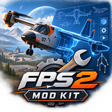

# FPS2 ModKit

**Build your own aircraft and fly it in [Frontier Pilot Simulator 2](https://fps2.frontierpilot.net/).**

FPS2 ModKit pairs **Unreal Engine 5.8** with **[JSBSim](https://github.com/JSBSim-Team/jsbsim)** flight dynamics: you build the aircraft in Unreal Engine and define how it actually flies in **JSBSim configuration files**.

## What's inside

The ModKit ships the game's precompiled runtime code, not the game project's source code:

* **ModKit** - the modding framework and tools
* **Game code** - the game's plugins and core provided as precompiled binaries; no C++ build is required, and mod development is done through the Unreal Editor and configuration files
* **ModExample** - a working example aircraft mod, your starting point
* **JSBSim configurations** - aircraft flight-model configuration files (`Plugins/FlightPhysics/Resources/aircraft`)
* **ModKit map** - the example map used to fly the included aircraft (`Content/Levels/ModKit.umap`)

## Quick start

1. Install **[Unreal Engine 5.8](https://www.unrealengine.com/download)**.
2. Open `FPS2.uproject`.
3. Open the map **`Content/Levels/ModKit`** in the Content Browser.
4. Press **Play** - the example `ModExample` aircraft is ready to fly.

The map is not set as a project default, so open it manually before pressing Play.
From there, inspect the kit, modify the example, or start building your own aircraft.

## Learn more

📖 **[Documentation](https://fps2.frontierpilot.net/frontier-pilot-simulator-2-modkit-documentation/)**
💬 **[Discord](https://discord.gg/qVxtGKQ5f2)**

## License

* **[Unreal Engine - Epic Games EULA](https://www.unrealengine.com/eula/unreal)** 
* **[JSBSim](https://github.com/JSBSim-Team/jsbsim?tab=LGPL-2.1-1-ov-file)**
* **[SDL2, SDL_GameControllerDB](https://github.com/mdqinc/SDL_GameControllerDB/blob/master/LICENSE)**
* **[JoystickPlugin](https://github.com/JaydenMaalouf/JoystickPlugin/blob/master/LICENSE)**
